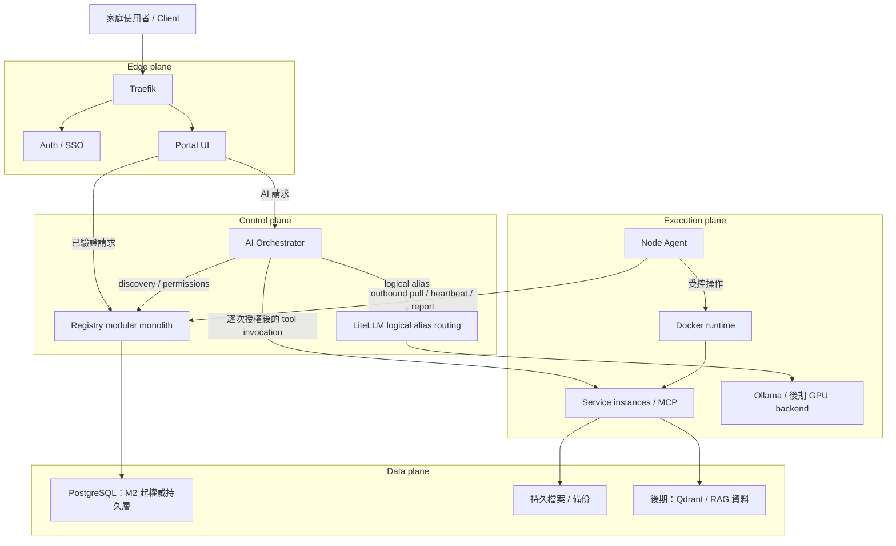
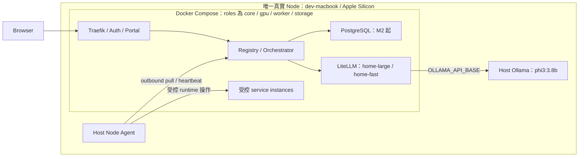
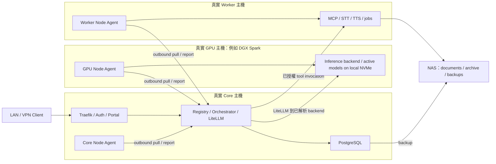
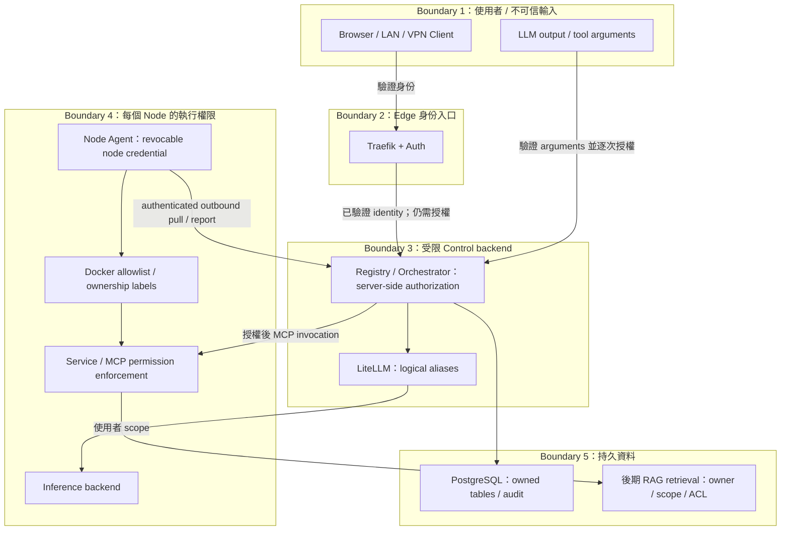
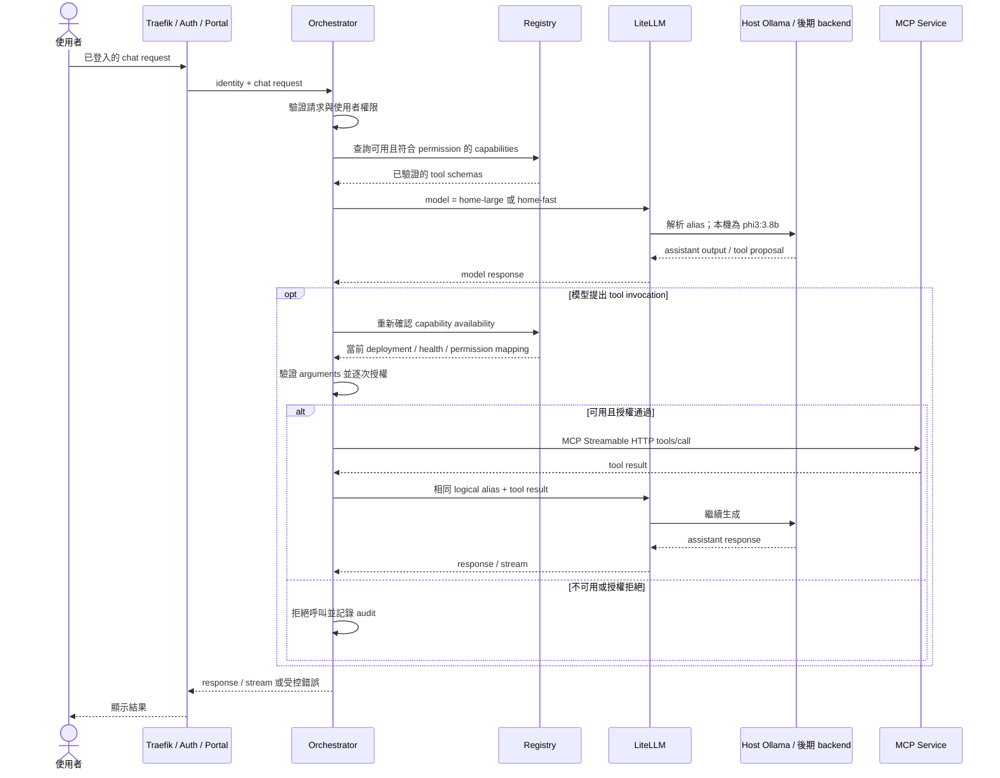

# 整體架構

Home AI Platform 將家庭內網中的 AI、工具與資料服務納入一致的平台契約。新增服務的路徑是宣告 metadata、建立具體 deployment、觀測健康，再暴露已授權的 UI 或 capability。服務可以只有 UI、只有 MCP，或同時提供兩者。

本文件固定責任與連線邊界；entity、Manifest、API、security 與里程碑各由[文件索引](README.md)列出的責任文件定義。圖中標示「後期」的元件是擴充邊界，不代表目前已有實作或屬於 M0–M3 依賴。

## 四 plane

| Plane | 元件與責任 | 邊界 |
| --- | --- | --- |
| Edge | Traefik、Auth/SSO、Portal UI；使用者入口、身份驗證、轉送請求與呈現管理狀態。 | 對外流量經 Traefik 與 authentication。UI 不持有 Node credential，也不能替代後端授權。 |
| Control | Registry-centered modular monolith 管理 definitions、deployments、nodes、capabilities、placement、reconciliation；Orchestrator 協調 AI 請求；LiteLLM 路由 logical aliases。 | Registry 擁有平台 intent；Orchestrator 逐次授權 tool invocation；只有 LiteLLM 解析模型 backend。這些元件屬同一 plane 不代表都併入 Registry 程序。 |
| Execution | Node Agent、Docker runtime、service instances、MCP services、Ollama/vLLM 等 inference backend。 | Agent 主動拉取受控命令，執行 allowlisted actions 並回報 observed state/health；runtime 與 backend 不直接暴露給使用者。 |
| Data | PostgreSQL、持久檔案與備份；後期加入 RAG 原始文件、Qdrant 與 ACL metadata。 | PostgreSQL 自 M2 起是平台權威持久層；儲存服務只接受授權 backend 存取，RAG retrieval 強制 scope/ACL。 |

Plane 是邏輯分工；同一台主機可承載所有 plane，同一個 deployment 也可能提供跨 plane 的服務介面。Node Agent 是 Execution plane 的 host daemon，其向 Control plane 通訊不授予其他 Node 的控制權。LiteLLM 雖處理 inference 流量，本文依其路由及 access boundary 責任歸入 Control plane。

### Component 圖

Registry 保存宣告、部署 intent 及合法觀測，根據 inventory 與 placement constraints 選擇實際 Node。`ServiceDefinition` 不含固定 node、完整 runtime URL、host IP 或直接 host path；`Deployment` 才承載執行位置與 resolved bindings。Discovery 從有效 deployment 與 named ports 解析 endpoint，Portal 不組合主機 IP 來呼叫服務。

Node Agent 每 15 秒送出 heartbeat；45 秒未收到就視為 offline。控制面對不同部署 generation 做 fencing，過期回報不能覆寫新 intent。Capability 只有在服務 healthy、Node online，且宣告 tools、實際 `tools/list` 與完整 permission mapping 相符時才可用；discovery 可用也不代表呼叫者已獲授權。

## Mac 單節點開發拓撲

Apple Silicon Mac 是唯一註冊的真實 Node，名稱固定為 `dev-macbook`。Docker Compose 承載開發用平台元件，Node Agent 作為 host daemon 管理該 Node 的受控 runtime。`core`、`gpu`、`worker`、`storage` profiles/labels 僅表達 roles；即使在不同 profile 啟動服務，也不能建立假冒的實體 Node、虛構 GPU inventory 或多節點故障域。

Host Ollama 固定載入 `phi3:3.8b`。LiteLLM 透過開發環境的 `OLLAMA_API_BASE` 連線到 host Ollama；該 endpoint 是部署設定，不寫入 portable `ServiceDefinition`。`home-large` 與 `home-fast` 均映射到同一模型，兩個 alias 的名稱不代表本機具備不同模型規模或效能保證。Embedding alias 延至 M7。

此拓撲描述交付過程中的目標配置，各元件依 milestone 啟用；不是要求 M0 一次啟動所有元件。M0–M3 先完成平台契約、持久化與控制流程，不無條件加入 Redis。Host Ollama 是開發用 inference dependency，不因此成為另一個註冊 Node，也不預設由 Node Agent 安裝或管理其程序。

## 未來多實體節點拓撲

實體擴充後，每台由平台管理的執行主機各自 enrollment，取得獨立 Node identity 與 credential。Core 主機承載 Edge、Control 與適合共置的 Data 元件；GPU 主機承載 inference workload；worker 主機承載 STT/TTS、背景工作等後期服務。NAS 提供文件、模型封存與備份；僅提供遠端儲存的 NAS 不因具備 `storage` role 就被當成可執行 Node。

圖中的主機角色不是 Manifest 固定 node name。服務移到不同 Node 時，改變 `Deployment` placement 與 runtime bindings；上層繼續使用 discovery 與 logical aliases。70B–80B 模型是後期 GPU 容量方向，不是本機開發依賴，也不是未經 benchmark 的效能承諾。Docker Compose 是起點；k3s、跨節點自動 failover 與進階 scheduling 不屬 M0–M3 範圍。

## Trust boundaries

內網優先不等於內網請求自動可信。身份驗證與 resource/action authorization 分開執行；Node credential 與使用者 identity 分開，且每個 Node 只可接收及回報屬於自己的命令。服務端點、資料庫與 inference backend 保持在受限 backend network，遠端使用者優先由 VPN 經統一 Edge 入口進入。

Node Agent 不提供未驗證的任意 shell execution；Docker 操作受 allowlist 與 ownership labels 約束。Manifest 不攜帶 literal secret；credential 與 host bindings 在執行環境解析。模型產生的 tool name、arguments 或文字不構成授權，MCP 呼叫必須同時檢查 capability 可用性與使用者 permission。後期 RAG 在 retrieval 層執行 ACL，不能只靠 Portal 隱藏資料。

## LLM request flow

Portal 的聊天請求由後端 Orchestrator 協調；所有 LLM caller，包括未來新增的 Portal backend 功能，都只能使用 LiteLLM logical aliases。Portal 與 Orchestrator 禁止直接連 Ollama、vLLM 或實體 GPU node。Gateway credential 保留於受限 backend，不交給瀏覽器。

MCP discovery 使用 Streamable HTTP；只有宣告 tools、實際 `tools/list` 與完整 permission mapping 相符且服務 healthy 時才提供 capability。圖中的可選 tool 路徑是後續整合邊界，不將 MCP、RAG 或 embedding 功能加入 M0–M3 的先決條件。一般聊天不需要呼叫工具；推論錯誤由上層呈現受控失敗，不繞過 LiteLLM 直接呼叫 backend。
