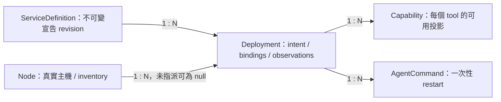

# Domain model

本文件定義平台 entity 的 identity、ownership 與狀態契約，沿用[架構](architecture.md)的四 plane。下列 TypeScript 是文件中的 contract examples，不是已建立的資料庫 schema、SDK 或可執行 validator；storage layout 與索引由後續實作決定。[Manifest contract](service-manifest.md)負責宣告欄位的驗證規則。

## Identity、ownership 與關係

| Entity | Identity 與權威 owner | 關係及責任 |
| --- | --- | --- |
| `Node` | Registry 配發不重用的 `nodeId`；Node Agent 回報 inventory，Registry 管理 identity、標籤及 online 判定。 | 一台真實主機一個 identity；roles 可複數。名稱不是 credential，也不是可攜 placement 的 target。 |
| `ServiceDefinition` | Registry 保存不可變 `serviceDefinitionId`；`name` + `version` 唯一。 | 一份通過 validation 的 Manifest revision；可有多個 Deployments，沒有 runtime state 或固定主機。更新宣告需新 version，不就地變更已部署 revision。 |
| `Deployment` | Registry 配發不重用的 `deploymentId` 並擁有 intent、assignment、generation。 | 指向一個 definition revision；M0–M3 每個 Deployment 最多指派一個 Node。Agent 只能回報被指派給自己的 observation。 |
| `Capability` | Registry 以 `capabilityId` 表達某個 deployment 的一項已宣告 tool。 | 綁定 definition、deployment、namespace、tool name 與 permissions；不是 MCP server 自行授予的權限，也不是跨 deployments 共用的健康狀態。 |
| `AgentCommand` | Registry 配發 `commandId` 並保留 lifecycle；Agent 回報執行結果。 | 一次性操作一個 Deployment 的指定 generation，v1 action 僅 `restart`。`start`/`stop` 是 desiredState mutation。 |



Definition revision、deployment 與 command 的 ID 均為不透明字串，不能由呼叫者以名稱推導。`Capability` 的邏輯 tool key 為 `namespace/toolName`；Registry 必須拒絕不同服務名稱占用同一 namespace。相同服務的多個 deployments 可提供同一邏輯 tool，但 availability 逐 deployment 計算，選中的 instance 必須重新通過 gate。

## Contract examples

所有時間字串採 UTC RFC 3339。欄位中的 `null` 表示尚未建立的 assignment、observation 或結果，不以空字串冒充。以下數值 `generation`/`observedGeneration` 均為整數。

```typescript
type DesiredState = "running" | "stopped";
type ObservedState =
  | "pending" | "deploying" | "running" | "stopping"
  | "stopped" | "failed" | "unknown";
type HealthStatus = "unknown" | "starting" | "healthy" | "unhealthy";

interface Node {
  nodeId: string;
  name: string;
  roles: string[];
  labels: Record<string, string>;
  inventory: {
    os: string;
    architecture: string;
    cpuCores: number;
    memoryBytes: number;
    gpuCount: number;
  };
  lastHeartbeatAt: string | null;
  online: boolean;
}

interface ServiceDefinition {
  serviceDefinitionId: string;
  name: string;
  version: string;
  apiVersion: "home-ai/v1";
  manifest: Record<string, unknown>;
}

interface Deployment {
  deploymentId: string;
  serviceDefinitionId: string;
  assignedNodeId: string | null;
  desiredState: DesiredState;
  observedState: ObservedState;
  healthStatus: HealthStatus;
  generation: number;
  observedGeneration: number;
  stateReason: string | null;
  resolvedBindings: {
    endpoints: Record<string, string>;
    storage: Record<string, string>;
    secrets: Record<string, string>;
  };
  lastReportedAt: string | null;
}

interface Capability {
  capabilityId: string;
  serviceDefinitionId: string;
  deploymentId: string;
  namespace: string;
  toolName: string;
  permissions: string[];
  discoveredGeneration: number | null;
  available: boolean;
  unavailableReason: string | null;
}

type AgentCommandStatus = "queued" | "running" | "succeeded" | "failed" | "expired";

interface AgentCommand {
  commandId: string;
  deploymentId: string;
  generation: number;
  action: "restart";
  status: AgentCommandStatus;
  createdAt: string;
  expiresAt: string;
  startedAt: string | null;
  completedAt: string | null;
  result: { summary: string } | null;
  error: { code: string; message: string } | null;
}
```

`ServiceDefinition.manifest` 的 `Record` 只避免在兩份文件重複完整型別，並不容許任意輸入；它必須符合 [home-ai/v1](service-manifest.md)。`resolvedBindings` 僅供受限 backend：endpoints 可含 runtime URL，storage 可含經管理員核准的實際 binding ID，secrets 只含 secret store reference，不含 secret value。對 Portal/API 的可見投影必須遮蔽內部位址、host storage 細節及 secret references；實際值只在被授權的 Node 執行環境注入。

`online`、`available` 是 Registry 計算的投影，不由 Agent 或使用者設定。`stateReason` 為當前不可用／轉換原因，例如 `AwaitingPlacement`、`NodeOffline`、`HealthCheckFailed`、`GenerationPending`、`RuntimeError`；這些是 reason examples，不是新增 state enums，也不可包含 credentials 或原始 secret。

## Deployment state machines

三種狀態分開記錄。`desiredState` 表達 intent；`observedState` 表達執行事實；`healthStatus` 表達探測結果。`desiredState=running` 不代表已執行，`observedState=running` 也不代表可以提供 capability。

| 事件 | Desired state | Observed state 與 health | Generation 行為 |
| --- | --- | --- | --- |
| 建立 deployment | 明確給定 `running` 或 `stopped` | 初始 `pending` / `unknown`，即使 desired 為 stopped 也等候 absence 確認。 | 初始 `generation=1`、`observedGeneration=0`。 |
| 指派並啟動 | `running` | `pending → deploying → running`；health `unknown → starting → healthy` 或 `unhealthy`。 | 指派與其他 intent 變更一併建立新 generation；Agent 回報它實際套用的 generation。 |
| 停止 | `stopped` | 當前狀態 `→ stopping → stopped`；停止開始即撤銷 availability，確認停止後 health 為 `unknown`。 | 變更 desiredState 時遞增。 |
| 再啟動 | `running` | `stopped → deploying → running`；重新進入 `starting`，不得沿用舊 healthy。 | 變更 desiredState 時遞增。 |
| Runtime 操作失敗 | 不自動改變 intent | `deploying`、`running`、`stopping → failed`；health `unknown` 或有新 probe 證據時 `unhealthy`。 | 失敗回報不能遞增 generation；重試仍須受控 reconciliation。 |
| Probe 失敗／恢復 | 不變 | 可保持 `running`；health `healthy ↔ unhealthy`，恢復需新成功 probe。 | 同 generation 更新 observation；healthy 恢復後仍需 MCP gate。 |
| Node offline／觀測失效 | 不變 | Registry 將有效投影置 `unknown` / `unknown`，reason `NodeOffline`。 | 保留最後 observedGeneration 作診斷，不冒充已確認新 intent。 |
| 重新連線 | 不變 | 由新 report 重新判定 `deploying`、`running`、`stopping`、`stopped` 或 `failed`。 | 只有符合當前 generation 才可重新計算 availability。 |

以上箭頭表示合法的一般轉換，不要求每個中間狀態都一定被網路回報看到。Agent 重連可直接回報已確認 `running` 或 `stopped`；Registry 仍驗證 node ownership、generation 與 report freshness。`failed` 表示操作／runtime 失敗，不能用來取代 health 的 `unhealthy`；`unknown` 表示缺乏可靠 observation，不能推斷 container 已停止。

Node Agent 每 15 秒 heartbeat；Registry 以伺服器接收時間判定距最後有效 heartbeat 達 45 秒為 offline。尚未收到 heartbeat 的 Node 不可 placement。重連不立即復原 capability；需要新鮮 deployment report、健康結果及 discovery。Offline 不觸發 M0–M3 自動跨 Node failover，以免在無法確認原 instance 停止時雙重執行。

## Generation fencing 與 command lifecycle

Registry 是 generation 唯一 writer。會改變 runtime intent 的 desiredState、assignment、definition revision、resolved binding 更新，以及接受一次新的 restart，都必須在同一受控 mutation 內遞增 generation 並撤銷原 availability；內容完全相同的冪等重送不重複遞增。當 `observedGeneration < generation`，舊 observation 只作歷史資訊，不能滿足當前 intent。

Agent 只可對指派給自己的 deployment 執行當前 generation；命令與 report 必須帶 deploymentId、generation，且由 Node credential 驗證歸屬。Registry 拒絕未指派 Node、較舊或未發出的較新 generation 回報更新當前狀態。相同 generation 內還須以控制協定的 report ordering/deduplication 排除重送與倒序事件；僅比 generation 不能判定兩份同代 report 的先後。`observedGeneration` 只能在接受有效 observation 時更新，不從 heartbeat 或 command success 推定。

`restart` 僅對 desiredState 為 `running` 且已指派 online Node 的 deployment 接受。建立 command 時在 transaction 內提升 deployment generation，command.generation 固定綁定該新值；若其後 stop、改派或其他新 intent 產生更高 generation，舊 restart 不得再執行。Agent 在實際 runtime mutation 前重新檢查最新已知 intent；若失聯則不可起始新的 mutation。已在執行中的外部操作不能由 fencing 倒轉，因此仍須後續 observation/reconciliation 收斂。

| Command lifecycle | 語意 |
| --- | --- |
| `queued → running` | Agent 接受有效、未過期且未執行的 command，開始受控 restart；填入 startedAt。 |
| `running → succeeded` | 受控 restart 操作完成，保存 result 與 completedAt；不等同健康或 discovery 成功。 |
| `queued/running → failed` | 驗證、generation 或 runtime 操作失敗；保存具名 error 與 completedAt。 |
| `queued/running → expired` | 到達 expiresAt 仍未完成；保存 timeout error 與 completedAt，不再派送。 |

Terminal command 不再回到 queued；晚到結果只留 audit，不能覆寫 terminal status。`expired` 不證明執行中的 container 操作已取消；control plane 應以 observation 追蹤結果，不能自動以新 commandId 重做同一 restart。相同 commandId 重送時 Agent 返回已知進度／結果，不能再次 restart。`result` 僅於 succeeded 有值；`error` 僅於 failed/expired 有值，其餘為 null。

## Capability availability

Capability availability 是可以撤銷的 backend 投影，不是持久的授權承諾。基礎條件為 definition revision 有效、assigned Node online、desiredState 與 observedState 皆為 `running`、`observedGeneration = generation`、discovery 屬於同一 generation，且沒有未處理的 stale observation。

在此基礎上，MCP 必須同時通過四重 gate：

1. Manifest 宣告明確的 namespace 與 allowed tools，沒有重複或 namespace 衝突。
2. Healthy 後完成 Streamable HTTP discovery，取得完整（含分頁）的 `tools/list`，實際 tool name 集合與 allowed tools 完全相等。
3. 每個 tool 都有完整、非空且有效的 permission mapping；沒有漏項、額外 tool 或未知 permission。
4. 當前 service instance `healthStatus=healthy`，且健康證據尚有效。

任一 gate 失敗就撤銷該 deployment 的 MCP capabilities，不保留部分通過的 tools。節點 offline、unhealthy、stop/restart、generation 改變、discovery 失敗或 `tools/list_changed` 都立即使舊快照不可用，重新驗證完成後才開放。`Capability.permissions` 來自通過驗證的 Manifest，不能由 server 回傳的 annotations 取代。

Available 不等於 caller authorized。Orchestrator 在提供 tools 給模型前過濾使用者權限，並在每次 `tools/call` 前重新檢查 availability、所有 required permissions 及 arguments；服務端仍執行 authorization。具體 discovery、cache invalidation 與 permission 規則見 [Manifest contract](service-manifest.md#mcp-discovery-與-permissions)。
